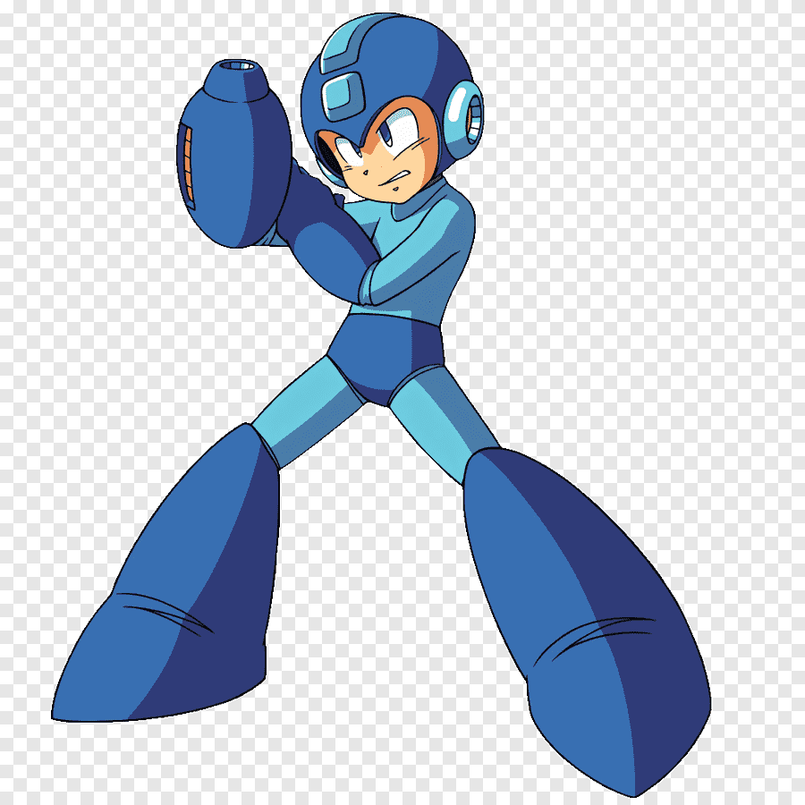

# Citação

> Estou fazendo testes de citação;
> Ainda estou fazendo o teste de citação;
> Mais uma vez, entro com este texto de citação;

# Lista não ordenada

- As cores do São Paulo
  - Preto;
  - Vermelho; 
  - Branco;

- Frutas;
  - Vermelhas;
  - Verdes;
  - Azul
 
# Outra forma de fazer a lista

* As cores do São Paulo
  * Preto;
  * Vermelho; 
  * Branco;

* Frutas;
  * Vermelhas;
  * Verdes;
  * Azul

# Lista Ordenada

1. As cores do São Paulo São:
  1.1. Prento;
  1.2. Vermelho;
  1.3. Branca;

2. Frutas;
  2.1. Abacaxi;
  2.2. Uva;
  2.3. Limão;

# Lista 0 automática

1. Letras;
 1. A;
 1. B;
 1. C;

# Imagens Locais

# Imagens da Web

